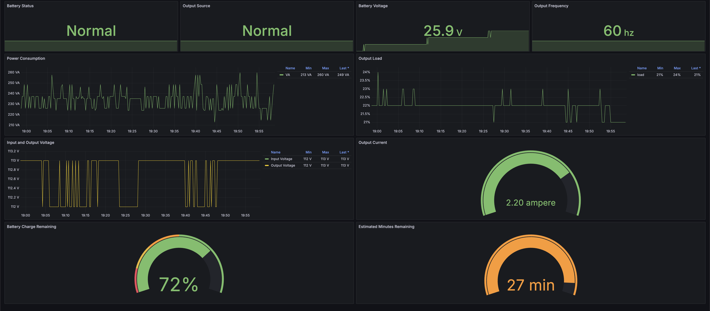

# CyberPower UPS SNMP Exporter for Prometheus

This exporter collects SNMP data from  [CyberPower PowerPanel Business for Linx](https://www.cyberpowersystems.com/product/software/power-panel-business/powerpanel-business-linux/). and exposes it as Prometheus metrics. It's designed to work with CyberPower PowerPanel Business on Linux with SNMPv1 enabled.



## Features

- Collects SNMP data from CyberPower PowerPanel Business server
- Exposes metrics in Prometheus format
- Includes a pre-configured Grafana dashboard for easy visualization
- Docker support for easy deployment

## Prerequisites

- Go 1.15 or higher
- CyberPower PowerPanel Business installed on a Linux system
- SNMPv1 enabled on the CyberPower PowerPanel Business server
- At least one UPS connected to the PowerPanel Business server via USB or serial console

## Installation

1. Clone this repository:
git clone https://github.com/ParinLL/cyberpower-ups-exporter.git
Copy
2. Navigate to the project directory:
cd cyberpower-ups-exporter
Copy
3. Build the exporter:
go build -o cyberpower_exporter
Copy
## Configuration

Set the following environment variables:

- `SNMP_TARGET`: IP address of your CyberPower PowerPanel Business server
- `SNMP_PORT`: SNMP port (default is 161)
- `SNMP_COMMUNITY`: SNMP community string (default is "public")
- `SERVER_PORT`: Port on which the exporter will serve metrics (default is 9100)


## Usage

You can run the exporter in two ways:

1. Set environment variables before running:
```bash
export SNMP_TARGET=192.168.1.1
export SNMP_PORT=161
export SNMP_COMMUNITY=public
export SERVER_PORT=9100
go run cyberpower_exporter.go
```
2. Set environment variables inline:
```bash
SNMP_TARGET=192.168.1.1 SNMP_PORT=161 SNMP_COMMUNITY=public SERVER_PORT=9100 go run cyberpower_exporter.go
```
The exporter will start serving metrics on `http://localhost::<SERVER_PORT>/metrics`.

## Docker

This project includes a Dockerfile for containerization and a docker-compose.yml for easy deployment.

To build and run the container:

1. Adjust the environment variables in docker-compose.yml to match your SNMP configuration.
2. Run:
```
docker compose up --build
```
3. The exporter will be accessible at http://localhost:9100/metrics

To stop the container:
```
docker compose down
```

## Grafana Dashboard

This project includes a pre-configured Grafana dashboard to visualize the metrics collected by the exporter. To use this dashboard:

1. Ensure you have Grafana installed and configured with your Prometheus data source.

2. Copy the dashboard JSON from the `grafana_dashboard.json` file in this repository.

3. In Grafana, navigate to "Create" > "Import".

4. Paste the JSON into the "Import via panel json" text area.

5. Click "Load".

6. Select your Prometheus data source in the "Prometheus" dropdown.

7. Click "Import".

The dashboard includes the following panels:

- Battery Status: A stat panel showing the current battery status.
- Battery Charge Remaining: A gauge showing the current battery charge percentage.
- Input and Output Voltage: A time series graph showing both input and output voltage over time.
- Output Load: A time series graph showing the UPS output load percentage over time.
- Battery Voltage: A gauge showing the current battery voltage.
- Estimated Minutes Remaining: A gauge showing the estimated runtime remaining on battery power.
- Output Current: A gauge showing the current output current.
- Output Frequency: A gauge showing the current output frequency.

You can further customize this dashboard to suit your specific needs by adding more panels or adjusting the existing ones.

### Updating the Dashboard

If you make changes to the exporter that affect the metrics, you may need to update the dashboard. To do this:

1. Make your changes in the Grafana UI.
2. Click the "Share dashboard" button (chain link icon) in the top right.
3. Go to the "Export" tab and select "Export for sharing externally".
4. Copy the JSON and update the `grafana_dashboard.json` file in this repository.

This will allow others to benefit from your improvements and keep the dashboard in sync with the exporter's capabilities.

## Metrics

This exporter provides the following metrics:

1. ups_battery_status: UPS Battery Status

    1: Unknown
    2: Normal
    3: Low
    4: Depleted


2. ups_seconds_on_battery: Time on battery in seconds
3. ups_estimated_minutes_remaining: Estimated battery runtime remaining in minutes
4. ups_estimated_charge_remaining: Estimated battery charge remaining in percent
5. ups_battery_voltage: Battery voltage in 0.1 Volt DC
6. ups_input_frequency: Input frequency in 0.1 Hertz
7. ups_input_voltage: Input voltage in RMS Volts
8. ups_output_source: Current source of output power

    1: Other
    2: None
    3: Normal
    4: Bypass
    5: Battery
    6: Booster
    7: Reducer
9. ups_output_frequency: Output frequency in 0.1 Hertz
10. ups_output_voltage: Output voltage in RMS Volts
11. ups_output_current: Output current in 0.1 RMS Amp
12. ups_output_power: Output power in Watts
13. ups_output_percent_load: Percentage of the UPS power capacity presently being used

## References

- [CyberPower PowerPanel Business for Linux](https://www.cyberpowersystems.com/product/software/power-panel-business/powerpanel-business-linux/): The software used to manage CyberPower UPS devices.

- [LibreNMS UPS-MIB](https://github.com/librenms/librenms/blob/master/mibs/UPS-MIB): The standard UPS MIB used as a reference for this exporter.

- [CyberPower MIB Files](https://www.cyberpowersystems.com/products/software/mib-files/): Official MIB files provided by CyberPower Systems.

This exporter uses the standard UPS-MIB as defined in RFC 1628, which is compatible with most UPS devices. The CyberPower-specific MIB files are not directly used in this exporter but can be helpful for understanding additional CyberPower-specific OIDs if you need to extend the exporter's functionality.

## Contributing

Contributions are welcome! Please feel free to submit a Pull Request.

## License

This project is licensed under the MIT License - see the LICENSE file for details.